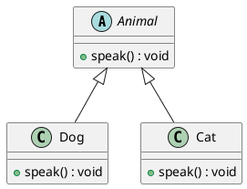
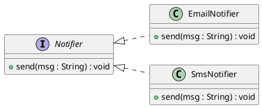

# Klasy i metody

W tym rozdziale omawiamy klasy i ich elementy składowe, a także metody klas i obiektów w językach Java i Python. Znajdziesz tu również rysunki/diagramy UML obrazujące relacje i pojęcia obiektowe.

Spis treści:
- 1. Co to jest klasa?
- 2. Elementy składowe klasy
- 3. Metody (instancyjne, klasowe, statyczne)
- 4. Przeciążanie i przesłanianie metod
- 5. Enkapsulacja i spójność
- 6. Diagramy UML (dziedziczenie, polimorfizm, enkapsulacja, abstrakcja)
- 7. Przykłady kodu (Java i Python)

## 1. Co to jest klasa?
Klasa to szablon (przepis), który definiuje:
- stan obiektów (pola/atrybuty),
- zachowanie (metody),
- reguły tworzenia obiektów (konstruktory / `__init__`).

Obiekt to instancja klasy – konkretny byt w czasie działania programu, posiadający własny stan (wartości pól) i potrafiący wykonywać operacje (wywoływać metody).

## 2. Elementy składowe klasy
- Pola / atrybuty (stan):
  - Java: pola instancyjne i statyczne (klasowe). Modyfikatory dostępu: `private`, brak (package-private), `protected`, `public`.
  - Python: atrybuty instancji (zwykle tworzone w `__init__`) i atrybuty klasowe (w ciele klasy). Konwencje: `_name` (wewnętrzne), `__name` (name mangling).
- Właściwości (Python): dekoratory `@property`, `@x.setter` pozwalają kontrolować dostęp (jak do pola), zachowując enkapsulację i walidację.
- Stałe:
  - Java: `static final` (np. `static final double PI = 3.1415;`).
  - Python: konwencja UPPER_CASE (np. `PI = 3.1415`).
- Inicjalizatory:
  - Java: blok inicjalizacyjny instancji `{ ... }` i blok statyczny `static { ... }` (rzadziej używane, ale przydatne np. do ładowania zasobów).
  - Python: logika inicjalizacji zwykle w `__init__`, ewentualnie w metodach klasowych tworzących obiekty (np. `from_config`).
- Konstruktory / inicjalizator instancji:
  - Java: metoda o nazwie klasy, bez typu zwracanego; może być przeciążana (różne listy parametrów).
  - Python: metoda `__init__(self, ...)` wywoływana po utworzeniu obiektu; przeciążania sygnatur nie ma, ale można stosować argumenty domyślne i parametry zmienne.
- Składowe zasięgu klasy:
  - Java: słowo kluczowe `static` (pola i metody, które „należą do klasy”).
  - Python: atrybuty zdefiniowane w ciele klasy bezpośrednio, metody oznaczone `@classmethod` i `@staticmethod`.

## 3. Metody
- Metody instancyjne – działają na konkretnej instancji:
  - Java: zwykłe metody, dostęp do pól przez `this`.
  - Python: pierwszy parametr to `self` (odniesienie do bieżącego obiektu).
- Metody klasowe i statyczne:
  - Java: `static` – brak dostępu do `this`; przydatne do narzędziowych operacji lub fabryk.
  - Python:
    - `@classmethod` – pierwszy parametr `cls` (referencja do klasy); dobre do alternatywnych konstruktorów.
    - `@staticmethod` – bez `self/cls`; funkcja pomocnicza logicznie związana z klasą.
- Metody specjalne (Python):
  - `__str__/__repr__` (reprezentacja tekstowa), `__eq__/__lt__` (porównywanie), `__len__`, `__iter__` i inne – integrują klasę z wbudowanymi mechanizmami języka.
- Modyfikatory/metadane:
  - Java: modyfikatory dostępu (widoczność), `final` (metody nieprzesłanialne), `abstract` (metoda bez implementacji), adnotacje (np. `@Override`).
  - Python: konwencje nazewnicze, dekoratory (np. `@property`, `@classmethod`), adnotacje typów (PEP 484) – nie są wymuszane w runtime, ale wspierają narzędzia.

## 4. Przeciążanie i przesłanianie metod
- Przeciążanie (overloading):
  - Java: wiele metod o tej samej nazwie i różnych listach parametrów.
  - Python: brak przeciążania sygnatur – stosujemy parametry opcjonalne, wzorce typu `*args/**kwargs` lub funkcje wielokrotnej dyspatchy (np. `functools.singledispatch`).
- Przesłanianie (overriding):
  - Java i Python: klasa pochodna może dostarczyć własną implementację metody z klasy bazowej. W Java stosujemy `@Override` dla bezpieczeństwa.

## 5. Enkapsulacja i spójność
- Ukrywaj stan i ujawniaj stabilne API (metody, właściwości).
- Zapewniaj niezmienniki – walidacja w konstruktorach, setterach/właściwościach.
- Minimalizuj sprzężenia – przyjmuj interfejsy/typy ogólne, nie ujawniaj pól bezpośrednio, ogranicz widoczność (`private`/konwencje `_name`).

## 6. Diagramy UML
Poniższe grafiki ilustrują kluczowe pojęcia obiektowe. Źródła PlantUML znajdują się w katalogu `images/01` jako pliki `.puml`.

- Enkapsulacja

  

  (źródło: images/01/enk.puml)

- Dziedziczenie

  

  (źródło: images/01/dzie.puml)

- Polimorfizm

  

  (źródło: images/01/poli.puml)

- Abstrakcja

  

  (źródło: images/01/abs.puml)

## 7. Przykłady kodu
Poniżej krótkie, samodzielne przykłady w obu językach, pokazujące typowe elementy klas i metod.

- Java – pola, konstruktor, metody instancyjne i statyczne

  ```java
  /**
   * Przykład klasy w Java z polami, konstruktorem, metodą instancyjną i statyczną.
   */
  public class Rectangle {
      // stała klasowa
      public static final String UNIT = "px";

      // pola instancyjne (enkapsulowane)
      private final int width;
      private final int height;

      // konstruktor
      public Rectangle(int width, int height) {
          if (width <= 0 || height <= 0) {
              throw new IllegalArgumentException("Wymiary muszą być dodatnie");
          }
          this.width = width;
          this.height = height;
      }

      // metoda instancyjna
      public int area() {
          return width * height;
      }

      // metoda statyczna (narzędziowa)
      public static Rectangle square(int size) {
          return new Rectangle(size, size);
      }

      @Override
      public String toString() {
          return String.format("%dx%d %s", width, height, UNIT);
      }
  }

  class Main {
      public static void main(String[] args) {
          Rectangle r = new Rectangle(10, 20);
          System.out.println(r + ", area=" + r.area());
          System.out.println(Rectangle.square(15));
      }
  }
  ```

- Python – atrybuty, właściwości, metody instancyjne, klasowe i statyczne

  ```python
  from __future__ import annotations

  class Rectangle:
      """Przykład klasy w Pythonie z właściwościami i metodami klasowymi/statycznymi."""

      UNIT = "px"  # atrybut klasowy (umowna stała)

      def __init__(self, width: int, height: int) -> None:
          if width <= 0 or height <= 0:
              raise ValueError("Wymiary muszą być dodatnie")
          self._width = width
          self._height = height

      @property
      def width(self) -> int:
          return self._width

      @width.setter
      def width(self, value: int) -> None:
          if value <= 0:
              raise ValueError("Szerokość musi być dodatnia")
          self._width = value

      @property
      def height(self) -> int:
          return self._height

      @height.setter
      def height(self, value: int) -> None:
          if value <= 0:
              raise ValueError("Wysokość musi być dodatnia")
          self._height = value

      # metoda instancyjna
      def area(self) -> int:
          return self._width * self._height

      # metoda klasowa (alternatywny konstruktor)
      @classmethod
      def square(cls, size: int) -> "Rectangle":
          return cls(size, size)

      # metoda statyczna
      @staticmethod
      def unit() -> str:
          return Rectangle.UNIT

      def __str__(self) -> str:
          return f"{self._width}x{self._height} {self.UNIT}"


  if __name__ == "__main__":
      r = Rectangle(10, 20)
      print(r, "area=", r.area())
      print(Rectangle.square(15))
      print(Rectangle.unit())
  ```

Powiązane zagadnienia: enkapsulacja (modyfikatory dostępu, właściwości), przeciążanie/przesłanianie, klasy abstrakcyjne i interfejsy, metody specjalne (Python), `final` i `abstract` (Java).
