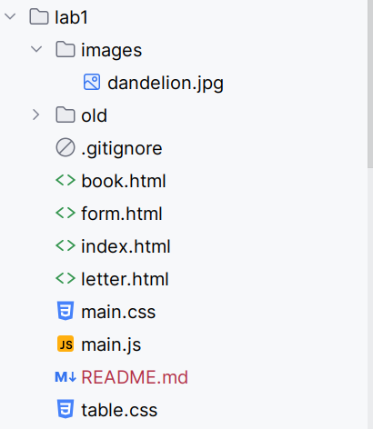

## I. Dokumentacja do lab. nr 1 - "Podstawy WWW" <a id="start"></a>
## II. Imię i nazwisko - grupa ABC, semestr III
## III. Przedmiot - "Programowanie obiektowe"

## IV. Opis zadania do realizacji
Do zrealizowania były następujące zadania:  
  - opis zadania nr 1 ...,  
  - opis zadania nr 1 ...,  
  - opis zadania nr 1 ...,  

## V. Technologie wykorzystane w zadaniu
  - Java,  
  - Python

## VI. Realizacja zadania
<br>

#### 1. Kod Javy (lub Pythona)
W zadaniu wykorzystano .... (krótko opisać, co z HTMLa zostało użyte).

Przykładowy kod HTML do pokazania (taki, który uważamy za ciekawy, warty pokazania):  

```java
    public class ObwodPoleKola {
      public static void main(String[] args) {
        int promienKola = 8;
        double pi = 3.14;
    
        double poleKola = pi * promienKola * promienKola;
        double obwodKola = 2 * pi * promienKola;
    
        System.out.println("Pole kola wynosi: " + poleKola);
        System.out.println("Obwod kola wynosi: " + obwodKola);
      }
    }
```
<br>

```python
# Calculate interest to track the growth of an investment


def invest(amount, rate, years):
    """Display year on year growth of an initial investment"""
    for year in range(1, years + 1):
        amount = amount * (1 + rate)
        print(f"year {year}: ${amount:,.2f}")


amount = float(input("Enter a principal amount: "))
rate = float(input("Enter an anual rate of return: "))
years = int(input("Enter a number of years: "))

invest(amount, rate, years)
```

#### 2. Zrzuty ekranu pokazujące wynik działania aplikacji/skryptu/strony HTML:  


#### 2a. Struktura projektu:  


<br>

## III. Dodatkowe informacje o zadaniu
Można tu wpisać informację o elementach, które nie zostały wymienione we wcześniejszych punktach.  

#### 1. Tabele w Markdownie

| Syntax        | Description     |
|:-------------:|:---------------:|
|    Header     |      Title      |
|   Paragraph   |      Text       |
<br>

#### 2. Linki
  - do stron: What is a [markup language](https://www.semrush.com/blog/markup-language/)?
  - do innych sekcji w dokumencie: 
      - w miejscu do którego chcemy się przenieść tworzymy znacznik `a` z atrybutem `id`, czyli np. `<a id="start"></a>`,  
      - tworzymy link do ww. znacznika za pomocą składni `[tekst linku](#id-w-znaczniku-a)`, w naszym przypadku może to być np. [Link do początku dokumentacji](#start).  
<br>
  
#### 3. Inne
  - wpisujemy informacje dotyczące zadania, które uważamy za istotne,  
  - ...